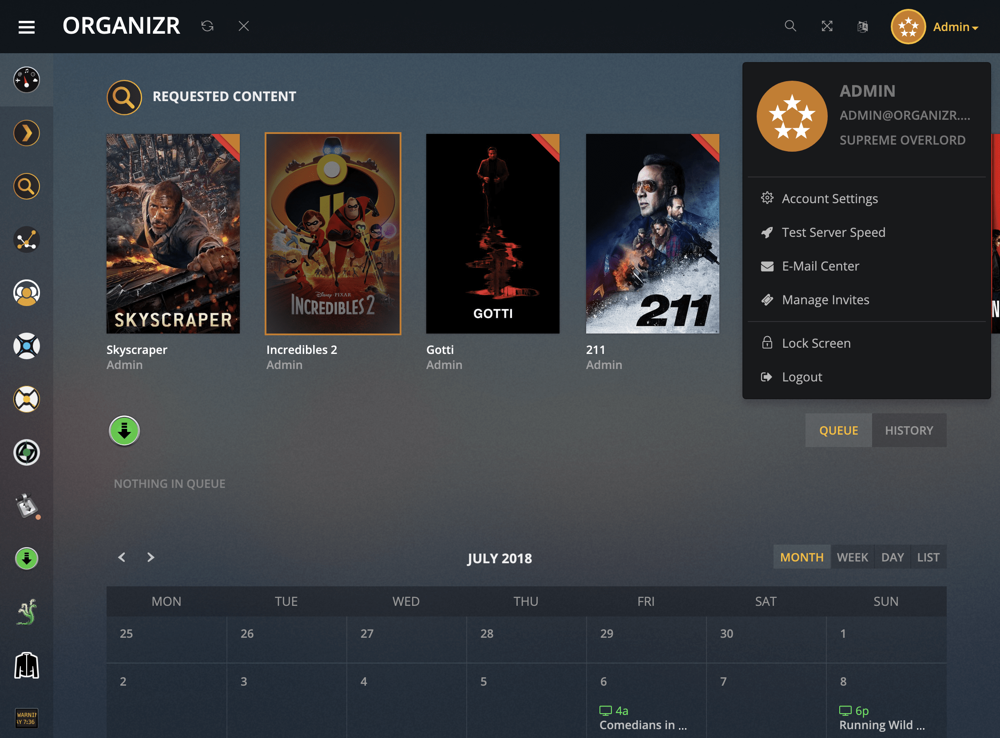
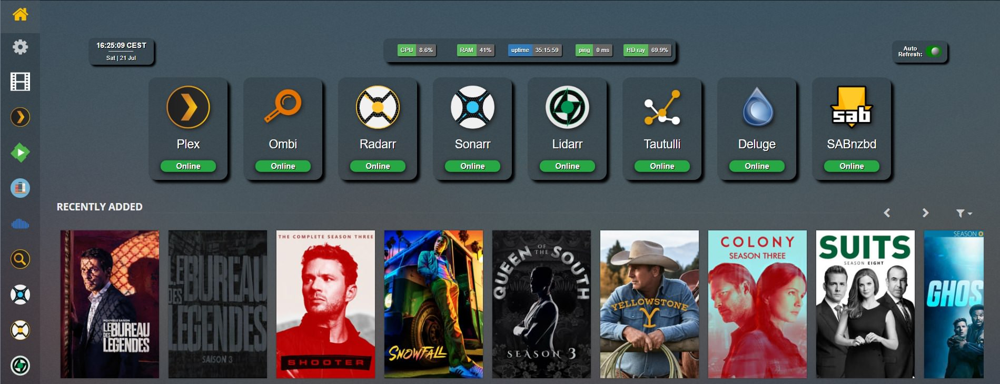
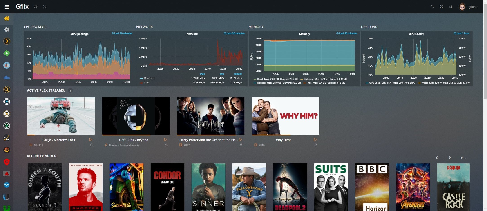

# V2Customizations
A repo for collecting customizations that works with Organizr V2

---
## PlexTheme

Brings the Plex-feel to organizr  
[Burry/organizr-v2-plex-theme](https://github.com/Burry/organizr-v2-plex-theme)

---

## theme.park

A collection of themes/skins for use in conjunction with [Organizr](https://github.com/causefx/Organizr)

[gilbN/theme.park](https://github.com/gilbN/theme.park)

##### MonitOrg

 
##### GrafOrg

##### OrgArr

##### NetOrg

